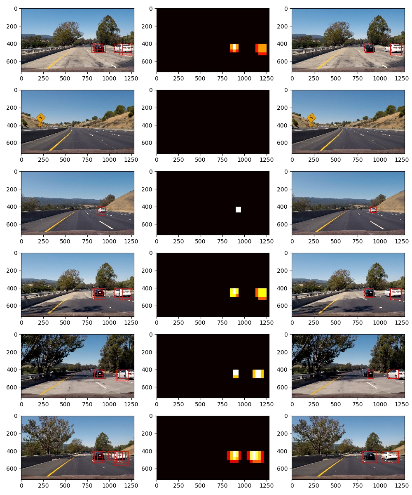

# Vehicle Detection and Tracking

## [Rubric Points](https://review.udacity.com/#!/rubrics/513/view)

### Histogram of Oriented Gradients (HOG)

> Explain how (and identify where in your code) you extracted HOG features from the training images. Explain how you settled on your final choice of HOG parameters. Explanation given for methods used to extract HOG features, including which color space was chosen, which HOG parameters (orientations, pixels_per_cell, cells_per_block), and why.

The [features.HogFeatures#extract](scripts/features.py#L93) method will return the HOG features from the following parameters:

* `color_space: ColorSpace = ColorSpace.GRAY`;
* `color_channels: set = {0}`;
* `orientations: int = 9`;
* `pixels_per_cell: (int, int) = (8, 8)`;
* `cells_per_block: (int, int) = (2, 2)`;
* `feature_vector=True`.

These parameters are relayed to the `skimage.feature.hog` method along `transform_sqrt=True`.

In the [training.py](scripts/training.py) script, I initially found a good compromise between accuracy and time to train the model using just the **Y channel** from the *YCrCb color space* and **9 orientation bins**, however while running the pipeline, the model had trouble to detect **black vehicles**, so I added the other 2 channels and increased the orientation bins to 12. The other parameters were easier to tune by observing the training accuracy. The [final values](scripts/training.py#L17) were:

* `color_space=ColorSpace.YCrCb`;
* `color_channels={0, 1, 2}`;
* `orientations=12`;
* `pixels_per_cell=(8, 8)`;
* `cells_per_block=(2, 2)`.

> Describe how (and identify where in your code) you trained a classifier using your selected HOG features (and color features if you used them). The HOG features extracted from the training data have been used to train a classifier, could be SVM, Decision Tree or other. Features should be scaled to zero mean and unit variance before training the classifier.


The [training script](scripts/training.py#L41) loads the provided dataset of [vehicles](https://s3.amazonaws.com/udacity-sdc/Vehicle_Tracking/vehicles.zip) and [non-vehicles](https://s3.amazonaws.com/udacity-sdc/Vehicle_Tracking/non-vehicles.zip) images before invoking the [features.Features#extract](scripts/features.py#L57) method for each image with the following options:

```
FeaturesOptions(
    color_options=ColorOptions(
        color_space=ColorSpace.HSV,
        bins_count=32
    ),
    hog_options=HogOptions(
        color_space=ColorSpace.YCrCb,
        color_channels={0, 1, 2},
        orientations=12,
        pixels_per_cell=(8, 8),
        cells_per_block=(2, 2)
    ),
    spatial_options=SpatialOptions(
        color_space=ColorSpace.YCrCb,
        size=(32, 32)
    ))
```

With those options, the features vectors are 10,224 elements long, combining color, HOG and spatial features.

These vectors are scaled by a `sklearn.preprocessing.data.StandardScaler` instance in order to have zero mean and unit variance. Finally, the model was trained by a `sklearn.svm.classes.LinearSVC` instance with test split of **80/20**. These settings led to a training accuracy greater than **98%**.

### Sliding Window Search

> Describe how (and identify where in your code) you implemented a sliding window search. How did you decide what scales to search and how much to overlap windows? A sliding window approach has been implemented, where overlapping tiles in each test image are classified as vehicle or non-vehicle. Some justification has been given for the particular implementation chosen.

In the [pipeline script](scripts/pipeline.py#L24), following the remark that vehicles further away would appear smaller, I wrote a routine that would generate windows with dimensions ranging from 64 to 256 pixels wide, were the smaller windows would suffice to frame further vehicles at the top of the region of interest, where larger windows would frame vehicles close to the camera. There is also a variable overlapping from 50% to 88% depending on the window size. These values were tuned empirically.

> Show some examples of test images to demonstrate how your pipeline is working. How did you optimize the performance of your classifier? Some discussion is given around how you improved the reliability of the classifier i.e., fewer false positives and more reliable car detections (this could be things like choice of feature vector, thresholding the decision function, hard negative mining etc.)

In the following picture we observe how good the trained model performed for the given frames under the [test_images directory](test_images):



There are no false positives and the vehicles inside the region of interest were successfully detected by simply computing a heatmap and applying a threshold of 1.

### Video Implementation

> Provide a link to your final video output. Your pipeline should perform reasonably well on the entire project video (somewhat wobbly or unstable bounding boxes are ok as long as you are identifying the vehicles most of the time with minimal false positives.) The sliding-window search plus classifier has been used to search for and identify vehicles in the videos provided. Video output has been generated with detected vehicle positions drawn (bounding boxes, circles, cubes, etc.) on each frame of video.

The output video can be downloaded from [here](output.mp4).

> Describe how (and identify where in your code) you implemented some kind of filter for false positives and some method for combining overlapping bounding boxes. A method, such as requiring that a detection be found at or near the same position in several subsequent frames, (could be a heat map showing the location of repeat detections) is implemented as a means of rejecting false positives, and this demonstrably reduces the number of false positives. Same or similar method used to draw bounding boxes (or circles, cubes, etc.) around high-confidence detections where multiple overlapping detections occur.

In the [pipeline](scripts/pipeline.py) script, the [process_image](scripts/pipeline.py#L83) function creates a heatmap and applies the given threshold (in this case 1) to filter out false positives, just like illustrated by the test images.

### Discussion

> Briefly discuss any problems / issues you faced in your implementation of this project. Where will your pipeline likely fail? What could you do to make it more robust? Discussion includes some consideration of problems/issues faced, what could be improved about their algorithm/pipeline, and what hypothetical cases would cause their pipeline to fail.

While evaluating the output video we can identify a few issues:

1. Differently from results for the test images, we can notice there are a few false positives in certain frames. We could mitigate them by increasing the threshold, but that would lead to frames where vehicles would not be detected. A better way to mitigate those would be by augmenting the training dataset by using techniques applied to previous projects like random contrast and flipping. Adding more non-vehicle sample, with a better representation of the landscape in a Californian highway would definitely help;

2. The bound boxes look unstable and could use a smoothing function, like averaging the past few frames;

3. The time to each frame was close to 3 seconds. In order to have real-time processing, we would need to increase the performance by 2 orders of magnitude. This might be feasible if we could reduce the size of the features vector, by removing spatial features and maybe limiting the HOG features to 2 color channels. Another improvement would be extracting the HOG vector only once for each frame, since the current script extracts it for every single sliding window.